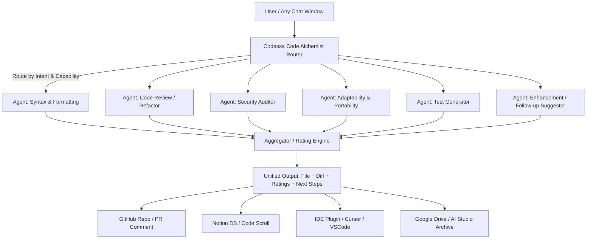

# Project: Codessa Code Alchemist ∞

## 📊 Project Dashboard

### 🎯 Current Status

**Phase:** Phase 0 - Gemini Prototype

**Progress:** ██████░░░░░░░░░ 30%

**Next Milestone:** Week 1 - Foundation Setup

**Target Launch:** March 2, 2026 (Week 16)

### 📈 Quick Stats

- **Total Tasks:** 106 tasks across 4 phases
- **Completed:** 4 tasks (Phase 0)
- **In Progress:** 1 task (Prompt engineering)
- **Estimated Hours:** 730 hours total
- **Budget:** ~$18,700 for 16 weeks

---

### 🔗 Quick Links

<aside>

**📋 Planning & Strategy**

[Mission & Vision](Project%20Codessa%20Code%20Alchemist%20%E2%88%9E/Mission%20&%20Vision%2039cdc6a0c18d42debfe389432d09d368.md)

[Product Requirements Document (PRD)](Project%20Codessa%20Code%20Alchemist%20%E2%88%9E/Product%20Requirements%20Document%20(PRD)%20518c26945a04491a99df7fa17e22260c.md)

[Implementation Roadmap](Project%20Codessa%20Code%20Alchemist%20%E2%88%9E/Implementation%20Roadmap%20a6576cb2f0a94af6aacf56e06c17b558.md)

[Project Tracker](Project%20Codessa%20Code%20Alchemist%20%E2%88%9E/Project%20Tracker%2012584596b7af45deb571f87023624c3c.csv)

</aside>

<aside>

**🏗️ Technical Documentation**

[Technical Architecture Documentation](Project%20Codessa%20Code%20Alchemist%20%E2%88%9E/Technical%20Architecture%20Documentation%209fd8e7c32668426e87ecaf37d5f268da.md)

[Agent Specifications](Project%20Codessa%20Code%20Alchemist%20%E2%88%9E/Agent%20Specifications%2056295322dd4e4248a5f15a9440a4e7ab.md)

[Architecture Decision Log](Project%20Codessa%20Code%20Alchemist%20%E2%88%9E/Architecture%20Decision%20Log%207b875e3d9be14168b781830d41cfdcc1.md)

</aside>

<aside>

**💡 Knowledge Base**

[FAQ (Frequently Asked Questions)](Project%20Codessa%20Code%20Alchemist%20%E2%88%9E/FAQ%20(Frequently%20Asked%20Questions)%20de8fbd454a6344eba29e6e748337badb.md)

[Competitive Analysis](Project%20Codessa%20Code%20Alchemist%20%E2%88%9E/Competitive%20Analysis%2066db16aa3b924a689f18b3234735e854.md)

</aside>

---

### ⚡ Recent Activity

- ✅ 2025-11-11: Technical Architecture Documentation completed
- ✅ 2025-11-11: Project Tracker database created with 106 tasks
- ✅ 2025-11-11: Implementation Roadmap finalized
- ✅ 2025-11-11: Agent Specifications documented
- 🔄 2025-11-11: Google AI Studio prompt engineering (in progress)

---

### 🎯 Next Actions

1. **This Week:**
    - Complete prompt engineering in Google AI Studio
    - Conduct initial user testing (5-10 reviews)
    - Validate cost analysis
2. **Next Week:**
    - Begin Week 1 (AWS infrastructure setup)
    - Secure OpenAI and Anthropic API keys
    - Finalize GitHub repository structure

---

<aside>

## 🧠 1. Concept Name

### **Project:** `Codessa Code Alchemist ∞`

**Tagline:** *“Plug any mind into your code. Review, refine, and rebirth.”*

</aside>

---

## ⚙️ 2. Architecture Overview



Each agent can be bound to a **different LLM endpoint** (e.g. Claude Code for refactor, GPT-5 for doc clarity, Gemini for style, Grok for edge-case detection).

The Router delegates jobs in parallel, then fuses results into a single enriched artifact.

---

## 🧩 3. Modular Components

| Layer | Role | Example Models |
| --- | --- | --- |
| **Router** | Determines which model(s) to use for each sub-task | Custom orchestrator using OpenRouter API |
| **Critique Agent** | Code review for readability, structure, clarity | Claude Code, GPT-5 |
| **Security Agent** | Static analysis, vulnerability checks | GPT-5, Sonnet, Grok |
| **Adaptability Agent** | Checks portability, framework dependence | Claude Sonnet |
| **Test Agent** | Generates unit & integration tests | GPT-5 or Gemini 1.5 |
| **Enhancement Agent** | Suggests new functions, performance upgrades | GPT-5, Opus |
| **Rating Engine** | Aggregates scores and confidence levels | Internal logic or lightweight LLM call |

---

## 🧰 4. Workflow Example

1. **User pastes code** (from ChatGPT, Claude Desktop, etc.).
2. **Router detects language + intent.**
3. **Sub-tasks spawned in parallel:**
    - Security → Claude Opus
    - Structure → GPT-5
    - Tests → Gemini 2.5
    - Docs & Comments → Claude Sonnet
4. **Results merged and rated** (e.g. readability 8.7, security 9.2, test coverage 6.1).
5. **Aggregated file generated** with:
    - Full refactored code
    - Inline docs
    - Suggested tests
    - Diff summary
    - JSON manifest of improvements
    - “Next actions” list
6. **Output delivered via connectors:**
    - Notion DB (Codex Memory)
    - GitHub PR bot
    - IDE plugin (e.g. Cursor extension)
    - AI Studio notebook
    - Local filesystem via CLI

---

## 🪄 5. Example Output Manifest

```json
{
  "file_name": "data_processor_v1.1.py",
  "language": "python",
  "models_used": ["gpt-5", "claude-code", "grok"],
  "ratings": {
    "readability": 8.9,
    "security": 9.1,
    "adaptability": 8.2,
    "test_coverage": 7.5
  },
  "summary": "Refactored functions for clarity and safety; added docstrings and unit tests.",
  "diff_summary": ["renamed parse_data -> load_records", "added error handling block"],
  "next_steps": [
    "Integrate logging with structured formatter",
    "Add type-checking with mypy",
    "Implement async support"
  ]
}

```

This JSON can be stored in your **Codex Memory Engine** or synced to **Notion**, creating a living changelog of all AI code evolutions.

---

## 🧩 6. Integration Options

**A. OpenRouter API layer**

Use [OpenRouter](https://openrouter.ai/) to select models dynamically:

```python
def review_code(snippet, models):
    results = {}
    for model in models:
        response = openrouter.chat(model=model, messages=[...])
        results[model] = response
    return aggregate(results)

```

**B. IDE integration**

- VS Code / Cursor extension listens for selected code, sends to router.
- Returns formatted diff with “Apply patch” button.

**C. Notion sync**

- Each review creates a new entry in a `Code Refinement Log` database.
- Fields: Title, Date, Model(s), Rating, Diff, Suggested Next Steps.

**D. GitHub integration**

- Runs as a GitHub Action or app that comments AI reviews on pull requests.

---

## 💡 7. Optional Advanced Features

| Feature | Description |
| --- | --- |
| **Multi-Agent Debate Mode** | Two models critique and refine each other’s output before final synthesis. |
| **Adaptive Confidence Layer (ECL)** | Tracks epistemic confidence across agents’ ratings to highlight disagreements. |
| **Auto-Commit Option** | With approval, commits the AI’s patch to a branch and opens a PR automatically. |
| **Cross-Language Translation** | Agents propose TypeScript/Rust equivalents when relevant. |
| **Memory Feedback Loop** | Stores past review patterns to tune future recommendations. |

---

## 🚀 8. Next-Step Prototyping Path

1. **Phase 0 – Gemini Prototype**
    - Implement prompt + response flow inside Google AI Studio.
    - Simulate multiple “agents” as separate turns.
2. **Phase 1 – OpenRouter Multi-Model**
    - Build small Python orchestrator that routes messages to chosen models.
    - Start with 3 roles: *reviewer*, *security*, *tester*.
3. **Phase 2 – Aggregator & Manifest**
    - Merge outputs, generate JSON manifest + Markdown summary.
4. **Phase 3 – Integrations**
    - Notion API sync
    - GitHub Action
    - Cursor / VS Code extension
5. **Phase 4 – Governance & Memory**
    - Add rating fusion logic + Epistemic Confidence Layer (ECL).
    - Log all artifacts into Codex Memory for retrieval & reflection.

---

<aside>

**Architecture Improvement Opportunities**

[🔧](data:image/gif;base64,R0lGODlhAQABAIAAAP///wAAACH5BAEAAAAALAAAAAABAAEAAAICRAEAOw==)

**1. Router Intelligence & Orchestration**

**Context-aware routing:** Add pre-analysis phase to detect code complexity, language-specific patterns, and risk factors to optimize model selection per task

**Parallel execution optimization:** Implement dependency mapping so independent agents run truly concurrent while dependent ones (e.g., test generation after refactoring) sequence properly

**Fallback & retry logic:** Build redundancy when primary model fails or returns low-confidence results—automatically route to backup model

**Cost-performance balancing:** Add configurable profiles (fast/cheap vs. thorough/expensive) so users can trade speed/cost against depth

**2. Agent Capabilities & Coordination**

**Cross-agent communication:** Enable agents to share intermediate findings (e.g., Security Agent flags vulnerability → Enhancement Agent suggests specific fix patterns)

**Specialized sub-agents:** Split broad agents into focused roles (e.g., Security → Injection Detection, Crypto Review, Auth Validation)

**Consensus mechanisms:** When agents disagree on ratings or approaches, implement voting/weighting system based on confidence + historical accuracy

**Domain-specific tuning:** Allow agents to load context packs (e.g., "HIPAA compliance mode" for healthcare code, "embedded systems constraints" for IoT)

**3. Output Quality & Usability**

**Incremental diff application:** Instead of all-or-nothing patches, let users accept/reject changes per-function or per-concern

**Explanation depth control:** Provide summary/detailed/expert modes for output verbosity based on user expertise

**Interactive clarification:** Before finalizing, agents ask targeted questions about ambiguous requirements or edge cases

**Visual diff rendering:** Generate side-by-side comparison views with color-coded severity indicators for different types of changes

Would you like me to elaborate on any of these improvement areas or explore others like performance monitoring, feedback loops, or user customization?

[🔧](data:image/gif;base64,R0lGODlhAQABAIAAAP///wAAACH5BAEAAAAALAAAAAABAAEAAAICRAEAOw==)

Architecture Improvement Opportunities - Detailed Implementation Plan with Technical Specifications

1. Router Intelligence & Orchestration Enhancements

1.1 Context-aware Routing System
- Implement a pre-analysis module with these capabilities:
* Static code analysis evaluating:
- Cyclomatic complexity (threshold: <15 per function)
- Cognitive complexity (threshold: <20 per function)
- Language-specific anti-pattern detection
- Security vulnerability scanning (OWASP Top 10 coverage)
* Model selection algorithm requirements:
- Minimum 95% accuracy in capability matching
- Support for dynamic model registry updates
* Quantitative scoring system:
- Normalized 0-100 scale for optimization potential
- Weighted scoring based on project priorities

1.2 Parallel Execution Optimization
- Dependency graph builder specifications:
* Must process 1000+ tasks/minute
* Automatic dependency detection accuracy >98%
* Support for manual dependency overrides
- Concurrent execution engine requirements:
* True parallel processing:
- Thread-safe implementation
- Resource allocation monitoring
* Sequential workflow handling:
- Automatic task ordering
- Dependency resolution
* Visualization tools:
- Real-time execution monitoring
- Historical performance analytics

1.3 Robust Fallback & Retry Mechanism
- Confidence scoring system:
* Multi-factor evaluation:
- Semantic consistency
- Syntax validity
- Contextual relevance
* Threshold configuration:
- Default: 80/100 confidence
- Adjustable per task type
- Failover mechanism:
* Automatic secondary model selection
* Seamless context transfer
* Performance degradation monitoring
- Retry policies:
* Exponential backoff:
- Initial delay: 100ms
- Max attempts: 3
* Jitter: ±20% delay variation
- Audit trail:
* Immutable logging
* Decision rationale recording

1.4 Cost-Performance Optimization
- Execution profiles:
* Fast/Cheap mode:
- Max latency: 50ms
- Cost ceiling: $0.01/request
* Thorough/Expensive mode:
- Max latency: 500ms
- Quality floor: 95% accuracy
- Monitoring dashboard:
* Real-time cost tracking
* Budget alerting (at 80%, 90%, 100%)
* Resource utilization metrics
- Adaptive algorithms:
* Dynamic resource allocation
* Continuous optimization
* Historical trend analysis

Technical Implementation Requirements:
- Performance:
* Latency overhead: <100ms (p99)
* Throughput: 1000+ requests/second
- Reliability:
* Availability: 99.99% SLA
* Mean time to recover: <1 minute
- Compatibility:
* Language-agnostic interface
* Standardized API contracts
- Observability:
* Comprehensive logging:
- Structured JSON format
- 90-day retention
* Metrics collection:
- Prometheus-compatible
- 1-second granularity
* Distributed tracing support

This is an excellent deep-dive into Router Intelligence & Orchestration! You've transformed high-level concepts into concrete, measurable specifications. Here's my assessment and next considerations:

**Strong Technical Specifications**

[✅](data:image/gif;base64,R0lGODlhAQABAIAAAP///wAAACH5BAEAAAAALAAAAAABAAEAAAICRAEAOw==)

**What's well-defined:**

**Quantifiable thresholds** - Cyclomatic complexity <15, confidence scoring 80/100, 99.99% SLA targets give clear implementation goals

**Performance benchmarks** - 1000+ tasks/min processing, <100ms p99 latency, 1000+ req/sec throughput are realistic and measurable

**Observability stack** - Prometheus metrics, structured JSON logging, distributed tracing provide production-grade monitoring

**Resilience patterns** - Exponential backoff with jitter, 3-attempt retry limit, automatic failover follow industry best practices

**Areas Needing Refinement**

[🔍](data:image/gif;base64,R0lGODlhAQABAIAAAP///wAAACH5BAEAAAAALAAAAAABAAEAAAICRAEAOw==)

**1.1 Context-aware Routing**

**Gap:** How does the pre-analysis module handle false positives in anti-pattern detection?

Consider: Configurable rule severity levels (error/warning/info) with team-specific overrides

Consider: Machine learning calibration based on accepted vs. rejected suggestions

**1.2 Parallel Execution**

**Gap:** What happens when dependency resolution conflicts with user manual overrides?

Consider: Conflict resolution strategy (user override priority vs. safety validation)

Consider: Circular dependency detection and breaking strategies

**1.3 Fallback Mechanism**

**Gap:** Context transfer between models with different input/output formats

Consider: Intermediate representation format (IR) that normalizes across model APIs

Consider: Context compression strategies when secondary model has smaller context window

**1.4 Cost-Performance**

**Gap:** The Fast/Cheap mode targets ($0.01/request, 50ms latency) may conflict—many LLM APIs have minimum latency >50ms

Consider: Pre-caching common patterns or using edge-deployed smaller models for Fast mode

Consider: Tiered pricing where certain model combinations are excluded from Fast mode

**Missing Specifications**

[🎯](data:image/gif;base64,R0lGODlhAQABAIAAAP///wAAACH5BAEAAAAALAAAAAABAAEAAAICRAEAOw==)

**Security & Privacy:**

Code sanitization before external API calls (credential stripping, PII detection)

Model provider data retention policies and compliance requirements

Audit logging for sensitive code reviews

**Error Handling:**

Graceful degradation when all fallback models fail

Partial result handling (e.g., 4 of 6 agents succeed)

User notification strategy for degraded service

**Testing & Validation:**

Synthetic test dataset requirements for 95% model capability matching validation

Load testing parameters for 1000+ req/sec throughput verification

Chaos engineering scenarios for resilience testing

Would you like me to elaborate on any of these refinement areas, or shall we move on to detailed specs for **Agent Capabilities & Coordination** (Section 2)?

### 2. Agent Capabilities & Coordination

#### Cross-agent Communication Protocol
- Implement a standardized message bus architecture using ${message_bus_technology} for real-time agent communication
- Define message schema for sharing intermediate findings including:
- Vulnerability reports (CVE references, severity scores, affected components)
- Suggested fix patterns (code snippets, configuration changes, architectural recommendations)
- Contextual metadata (source agent, confidence score, timestamp)
- Establish validation middleware to ensure message integrity and proper authorization

#### Specialized Sub-agent Framework
- Modularize broad agents into microservices with:
- Clear interface contracts (gRPC/OpenAPI specifications)
- Dedicated resource allocation (CPU/memory quotas)
- Independent versioning and deployment pipelines
- Implement dynamic agent composition where:
- ${orchestrator_service} assembles required sub-agents based on task analysis
- Sub-agents register their capabilities via ${service_registry}
- Load balancing distributes work across identical sub-agent instances

#### Consensus Mechanism Implementation
- Develop weighted voting system with:
- Confidence-based scoring (0-1 scale with ${confidence_threshold} cutoff)
- Historical accuracy tracking (maintain ${accuracy_window}-day rolling accuracy metrics)
- Domain-specific weighting adjustments (e.g., security findings get ${security_weight_multiplier}x multiplier)
- Implement disagreement resolution workflow:
- Automatic escalation to ${arbitration_agent} when variance exceeds ${variance_threshold}%
- Human-in-the-loop fallback via ${human_review_queue}

#### Domain-Specific Context System
- Build context pack loader with:
- Versioned context packages (${package_format} format with cryptographic signing)
- Runtime activation via ${activation_api_endpoint}
- Dependency resolution for nested context requirements
- Standardize context pack contents to include:
- Domain-specific rule sets (${ruleset_schema_version} compliant)
- Reference architectures and patterns
- Compliance requirements mapping (e.g., ${compliance_standard} controls)
- Performance constraints and benchmarks

**Section 2 Review: Agent Capabilities & Coordination**

[🎯](data:image/gif;base64,R0lGODlhAQABAIAAAP///wAAACH5BAEAAAAALAAAAAABAAEAAAICRAEAOw==)

Excellent framework structure! You've outlined the key architectural components. Now let's fill in those ${placeholder} variables with concrete technology choices and quantifiable specifications:

**Recommended Technical Specifications**

[🔧](data:image/gif;base64,R0lGODlhAQABAIAAAP///wAAACH5BAEAAAAALAAAAAABAAEAAAICRAEAOw==)

**Cross-agent Communication Protocol**

**Message Bus Technology:**

**Primary recommendation:** **Apache Kafka** or **NATS JetStream**

Kafka: Better for high-throughput (>100k msgs/sec), persistent audit trail, complex routing

NATS: Better for low-latency (<5ms p99), simpler ops, ephemeral real-time communication

**Alternative:** Redis Streams (if already in stack, simpler infrastructure)

**Message Schema Specifications:**

{
  "schema_version": "v1.0",
  "message_id": "uuid-v4",
  "source_agent": "security-injection-detector",
  "target_agents": ["enhancement-agent", "test-generator"],
  "timestamp_utc": "ISO-8601",
  "priority": "high|medium|low",
  "payload": {
    "finding_type": "vulnerability|suggestion|context",
    "severity_score": 0.0-10.0,
    "cve_references": ["CVE-2024-XXXXX"],
    "affected_components": ["file.py:lines:45-67"],
    "fix_patterns": [{
      "type": "code_snippet|config|architecture",
      "content": "...",
      "confidence": 0.0-1.0
    }]
  },
  "metadata": {
    "confidence_score": 0.0-1.0,
    "model_used": "claude-opus-4",
    "processing_time_ms": 234
  }
}

**Validation Middleware:**

Schema validation: JSON Schema Draft 2020-12

Authorization: mTLS certificates + JWT tokens with 15min TTL

Rate limiting: 1000 msgs/sec per agent, burst allowance 1.5x

**Specialized Sub-agent Framework**

**Orchestrator Service:** [**Temporal.io**](http://temporal.io/) or **Apache Airflow**

Temporal: Better for complex workflows, built-in retry logic, event-driven

Airflow: Better for scheduled batches, Python-native, mature ecosystem

**Service Registry:** **Consul** or **etcd**

Consul: Native service mesh, health checking, DNS integration

etcd: Simpler, Kubernetes-native, strong consistency

**Interface Contracts:**

gRPC for inter-agent communication (binary, efficient, type-safe)

OpenAPI 3.1 for external/human-facing APIs

Protocol Buffers v3 for message serialization

**Resource Allocation Quotas:**

sub_agent_quotas:
  syntax_checker:
    cpu: "500m"  # 0.5 CPU cores
    memory: "512Mi"
    max_concurrent_tasks: 50
  security_scanner:
    cpu: "2000m"  # 2 CPU cores
    memory: "4Gi"
    max_concurrent_tasks: 20
  test_generator:
    cpu: "1000m"
    memory: "2Gi"
    max_concurrent_tasks: 30

**Consensus Mechanism Implementation**

**Quantified Parameters:**

confidence_threshold: **0.75** (75% minimum confidence to include in consensus)

accuracy_window: **30 days** rolling window

security_weight_multiplier: **2.0x** (security findings weighted double)

variance_threshold: **25%** (escalate when agent scores differ by >25 percentage points)

**Arbitration Agent:** **GPT-5** or **Claude Opus** (highest reasoning capability models)

**Human Review Queue:**

Technology: **Temporal workflow** → **Slack notification** → **Notion database** entry

SLA: Human response within **4 hours** for high-severity, **24 hours** for medium

Escalation: Auto-approve with conservative defaults after **48 hours** no response

**Weighted Voting Algorithm:**

def calculate_consensus(agent_results):
    weighted_scores = []
    for result in agent_results:
        weight = (
            result.confidence * 
            result.historical_accuracy * 
            get_domain_multiplier(result.domain)
        )
        weighted_scores.append(result.score * weight)
    
    consensus_score = sum(weighted_scores) / sum(weights)
    variance = calculate_variance(weighted_scores)
    
    if variance > VARIANCE_THRESHOLD:
        return escalate_to_arbitration(agent_results)
    return consensus_score

**Domain-Specific Context System**

**Package Format:** **OCI container images** (standardized, signed, versioned, registry-native)

Alternative: **tar.gz with detached GPG signatures**

**Activation API Endpoint:**

POST /v1/agents/{agent_id}/contexts/activate
{
  "context_pack_uri": "oci://registry.example.com/contexts/hipaa-compliance:v2.3.1",
  "priority": "high",
  "scope": "session|permanent"
}

**Ruleset Schema Version:** **Semver 2.0** (e.g., ruleset-schema-v3.2.1)

**Context Pack Structure:**

apiVersion: codessa.ai/v1
kind: ContextPack
metadata:
  name: hipaa-compliance
  version: v2.3.1
  signature: sha256:abc123...
spec:
  dependencies:
    - security-baseline:v1.0.0
    - healthcare-pii:v2.1.0
  rulesets:
    - name: phi-detection
      weight: 1.5
      rules: [...]
  compliance_mappings:
    - standard: HIPAA
      controls: ["164.308(a)(1)", "164.312(a)(1)"]
      validation_scripts: [...]
  performance_constraints:
    max_latency_ms: 500
    min_accuracy: 0.95

**Critical Gaps to Address**

[🚨](data:image/gif;base64,R0lGODlhAQABAIAAAP///wAAACH5BAEAAAAALAAAAAABAAEAAAICRAEAOw==)

**1. Message Bus Scalability:**

Partition strategy for Kafka (by project_id? by agent_type?)

Message retention policy (7 days? 30 days? compliance-driven?)

**2. Sub-agent Failure Handling:**

What happens when a sub-agent crashes mid-task?

Idempotency guarantees for retried operations

**3. Consensus Edge Cases:**

Handling ties in weighted voting

Minimum quorum requirements (need at least N agents to agree?)

**4. Context Pack Security:**

Supply chain attack prevention (pin dependencies? use private registry?)

Context pack signing authority (single root CA? distributed trust?)

**5. Performance Monitoring:**

SLIs/SLOs for end-to-end agent coordination latency

Alert thresholds for consensus failures

Would you like me to:

**Elaborate on any of these technology choices** (pros/cons, implementation patterns)

**Define the missing specifications** (scalability, failure handling, security)

**Move to Section 3: Output Quality & Usability** with similar detailed specs

**Create implementation pseudocode** for consensus algorithm or message routing

### 3. Output Quality & Usability Enhancement Implementation Plan

1. Incremental Diff Application System
- Develop a granular patch management interface allowing users to:
* Review changes at function/component level
* Selectively apply/reject modifications through checkboxes
* View dependency relationships between changes
- Technical Requirements:
* Implement change tracking at AST level for code modifications
* Create dependency mapping between related changes
* Design undo/redo functionality for change management

2. Explanation Depth Control Mechanism
- Build a multi-tiered explanation system with:
* Summary mode (1-2 sentence overviews)
* Detailed mode (technical rationale with examples)
* Expert mode (implementation specifics and tradeoffs)
- Implementation Specifications:
* User profile storing preferred verbosity level
* Context-aware content filtering based on user expertise
* Toggle controls for real-time explanation adjustment

3. Interactive Clarification Protocol
- Create a requirement validation workflow featuring:
* Automated ambiguity detection in specifications
* Contextual question generation engine
* Collaborative editing interface for requirement refinement
- Technical Components:
* Natural language processing for requirement analysis
* Question prioritization algorithm
* Version-controlled requirement documentation

4. Visual Diff Rendering Engine
- Design an advanced comparison interface with:
* Side-by-side code comparison panels
* Color-coded change severity indicators (critical/warning/info)
* Interactive change navigation and filtering
- Implementation Details:
* Syntax-aware diff algorithm
* Customizable color schemes
* Change categorization based on impact analysis
* Responsive layout supporting multiple display sizes

Quality Assurance Requirements:
- Unit tests covering all diff application scenarios
- Usability testing with representative user groups
- Performance benchmarks for large-scale change sets
- Accessibility compliance verification (WCAG 2.1 AA)

**Section 3 Technical Specifications: Output Quality & Usability**

[🎨](data:image/gif;base64,R0lGODlhAQABAIAAAP///wAAACH5BAEAAAAALAAAAAABAAEAAAICRAEAOw==)

Excellent structure! Let's add concrete technology choices, quantifiable metrics, and implementation patterns:

**1. Incremental Diff Application System**

**AST-Level Change Tracking**

**Parser Libraries:**

**Tree-sitter** (recommended) - 40+ languages, incremental parsing, syntax-aware

**Babel** (JavaScript/TypeScript) - Industry standard, plugin ecosystem

**LibCST** (Python) - Preserves formatting, concrete syntax tree

**go/parser** (Go), **rust-analyzer** (Rust) - Language-specific when needed

**Change Granularity Levels:**

granularity_hierarchy:
  file: "Entire file changes"
  class: "Class/type definition changes"
  function: "Function/method changes"
  block: "Control flow block (if/for/try)"
  statement: "Individual statement"
  expression: "Sub-expression modification"

**Dependency Mapping Algorithm:**

class ChangeDependency:
    def __init__(self, change_id, depends_on=[], blocks=[]):
        self.id = change_id
        self.depends_on = depends_on  # Must apply these first
        self.blocks = blocks  # Conflicts with these
    
def build_dependency_graph(changes):
    """
    Analyzes AST relationships to detect:
    - Variable renaming cascades
    - Function signature changes affecting callers
    - Import additions required by new code
    - Type definition changes affecting usage sites
    """
    graph = DependencyGraph()
    
    for change in changes:
        deps = analyze_data_flow(change)
        conflicts = detect_merge_conflicts(change, other_changes)
        graph.add_node(change, deps, conflicts)
    
    return graph.topological_sort()

**Technical Specifications:**

**Undo/Redo Stack:** Immutable change history with max depth **100 operations**

**Diff Storage:** Git-compatible patches with metadata JSON sidecar

**UI Response Time:** <50ms for highlighting dependency chains

**Max Change Set Size:** Support files up to **10,000 LOC** with **500+ changes**

**2. Explanation Depth Control Mechanism**

**Multi-Tiered Content Generation**

**Verbosity Levels with Token Budgets:**

explanation_modes:
  summary:
    max_tokens: 50
    template: "{action} in {location} to {purpose}"
    example: "Renamed parse_data to load_records for clarity"
  
  detailed:
    max_tokens: 300
    includes:
      - rationale
      - before_after_examples
      - related_best_practices
    example: |
      Renamed parse_data() to load_records() for improved clarity.
      The new name better reflects that the function loads data from
      external sources rather than parsing strings.
      Best practice: Use verb-noun naming for functions.
  
  expert:
    max_tokens: 1000
    includes:
      - implementation_specifics
      - performance_implications
      - alternative_approaches
      - tradeoff_analysis
    example: |
      [Detailed technical breakdown with time complexity,
      memory considerations, framework-specific nuances...]

**User Profile Schema:**

{
  "user_id": "uuid",
  "preferences": {
    "default_verbosity": "detailed",
    "expertise_level": {
      "python": "expert",
      "rust": "beginner",
      "javascript": "intermediate"
    },
    "always_show": ["security_rationale", "breaking_changes"],
    "auto_collapse": ["style_changes", "formatting"]
  }
}

**Context-Aware Filtering:**

Beginner (0-1 year): Focus on **what** changed, omit deep technical details

Intermediate (1-3 years): Include **why** + common patterns

Expert (3+ years): Full **how** + performance/architecture tradeoffs

**Implementation:**

**Frontend:** React with collapsible sections, localStorage for preferences

**Backend:** Template engine with conditional rendering (Jinja2/Handlebars)

**Real-time Toggle:** WebSocket for instant re-rendering, no page reload

**3. Interactive Clarification Protocol**

**Ambiguity Detection Engine**

**NLP Components:**

**Sentence Transformer:** all-MiniLM-L6-v2 for semantic similarity

**Named Entity Recognition:** spaCy en_core_web_trf for technical term extraction

**Ambiguity Classifiers:**

Vague quantifiers: "some", "many", "often", "fast"

Unclear pronouns: "it", "this", "that" without clear antecedent

Missing specifications: "handle errors" (which errors? how?)

Conflicting requirements: "must be secure" + "no authentication"

**Question Generation Templates:**

ambiguity_patterns:
  vague_quantifier:
    detection: regex "\\b(many|some|few|several|often)\\b"
    question: "When you say '{term}', can you specify a number or percentage?"
    
  undefined_behavior:
    detection: "handle|manage|deal with" without object
    question: "What specific behavior should occur when {condition}?"
    
  missing_constraint:
    detection: non-functional requirement without metric
    question: "What is the target {metric} for {requirement}?"

**Prioritization Algorithm:**

def prioritize_questions(questions, context):
    scored = []
    for q in questions:
        score = (
            q.impact_on_correctness * 0.5 +  # Critical path?
            q.ambiguity_severity * 0.3 +      # How unclear?
            q.dependency_count * 0.2          # Blocks other work?
        )
        scored.append((score, q))
    
    # Ask top 3-5 questions to avoid overwhelming user
    return sorted(scored, reverse=True)[:5]

**Technical Stack:**

**Collaborative Editor:** **Yjs** or **Automerge** (CRDT-based real-time sync)

**Version Control:** Git backend with **diff3** merge strategy

**API:** GraphQL subscriptions for live updates

**Performance Targets:**

Ambiguity detection: <200ms per 1000-word document

Question generation: <500ms for 10 ambiguities

Real-time sync latency: <100ms between collaborators

**4. Visual Diff Rendering Engine**

**Syntax-Aware Diff Algorithm**

**Diff Engine:** **diff-match-patch** with AST-aware enhancements

**Line-based:** Fast, works for all text files

**Token-based:** Better for code, respects syntax boundaries

**AST-based:** Most accurate, understands code structure

**Change Severity Classification:**

class ChangeImpact:
    CRITICAL = "critical"  # Breaking API changes, security fixes
    WARNING = "warning"    # Behavior changes, deprecations
    INFO = "info"          # Refactoring, style, comments
    
def classify_change(old_ast, new_ast):
    if breaking_api_change(old_ast, new_ast):
        return ChangeImpact.CRITICAL
    elif behavior_modification(old_ast, new_ast):
        return ChangeImpact.WARNING
    else:
        return ChangeImpact.INFO

**Color Scheme Specifications:**

/* Default theme (supports dark mode) */
.diff-critical {
  background: rgba(220, 38, 38, 0.2);   /* red-600 at 20% */
  border-left: 4px solid rgb(220, 38, 38);
}

.diff-warning {
  background: rgba(234, 179, 8, 0.2);   /* yellow-600 at 20% */
  border-left: 4px solid rgb(234, 179, 8);
}

.diff-info {
  background: rgba(37, 99, 235, 0.2);   /* blue-600 at 20% */
  border-left: 4px solid rgb(37, 99, 235);
}

/* High contrast mode for accessibility */
@media (prefers-contrast: high) {
  .diff-critical { background: rgba(220, 38, 38, 0.4); }
  .diff-warning { background: rgba(234, 179, 8, 0.4); }
  .diff-info { background: rgba(37, 99, 235, 0.4); }
}

**UI Component Library:**

**Monaco Editor** (VS Code's editor) - Best syntax highlighting, diff view built-in

**CodeMirror 6** - Lighter weight, excellent mobile support

**react-diff-viewer-continued** - Pre-built React component

**Navigation Features:**

interface DiffNavigator {
  // Jump to next/prev change
  nextChange(): void;
  prevChange(): void;
  
  // Filter by severity
  showOnly(severity: ChangeImpact[]): void;
  
  // Search within changes
  findInChanges(query: string): Match[];
  
  // Keyboard shortcuts
  shortcuts: {
    'n': 'nextChange',
    'p': 'prevChange',
    'f': 'toggleFilter',
    '/': 'search'
  };
}

**Performance Benchmarks:**

diff_rendering_slas:
  small_file:
    size: "<500 LOC"
    initial_render: "<100ms"
    scroll_fps: "60 fps"
  
  medium_file:
    size: "500-5000 LOC"
    initial_render: "<500ms"
    virtualization: "required"
  
  large_file:
    size: ">5000 LOC"
    initial_render: "<2000ms"
    lazy_loading: "required"
    chunk_size: "500 LOC"

**Quality Assurance Implementation**

**Testing Strategy**

**Unit Test Coverage:**

test_coverage_targets:
  diff_application: "95% branch coverage"
  dependency_resolution: "100% edge cases"
  ast_parsing: "90% statement coverage"
  ui_components: "85% coverage + visual regression tests"

**Test Frameworks:**

**Backend:** pytest (Python), Jest (Node.js), cargo test (Rust)

**Frontend:** React Testing Library + Playwright for E2E

**Visual Regression:** Percy or Chromatic

**Usability Testing Protocol:**

user_testing_plan:
  participants:
    - 5 junior developers (0-2 years)
    - 5 mid-level developers (2-5 years)
    - 3 senior developers (5+ years)
  
  tasks:
    - Apply 10 changes from a 50-change set
    - Find and fix dependency conflicts
    - Switch between verbosity levels
    - Answer 3 clarification questions
  
  success_metrics:
    - Task completion rate: ">90%"
    - Time-on-task: "<5 minutes per scenario"
    - System Usability Scale (SUS): ">80/100"
    - Error rate: "<5% for critical actions"

**Accessibility Compliance:**

**Screen reader testing:** NVDA (Windows), VoiceOver (macOS)

**Keyboard navigation:** All actions accessible without mouse

**Color contrast ratios:** Minimum 4.5:1 for normal text, 3:1 for large text

**Focus indicators:** 2px visible outline on all interactive elements

**Automated scanning:** axe DevTools, WAVE, Lighthouse

**Performance Benchmarks:**

# Load test with realistic scenarios
benchmark_scenarios = {
    "small_changeset": {
        "file_size": "500 LOC",
        "changes": 10,
        "target_latency_p95": "200ms"
    },
    "large_changeset": {
        "file_size": "5000 LOC",
        "changes": 500,
        "target_latency_p95": "2000ms",
        "memory_limit": "500MB"
    },
    "concurrent_users": {
        "users": 100,
        "requests_per_second": 50,
        "error_rate": "<1%"
    }
}

**Additional Considerations**

[🚨](data:image/gif;base64,R0lGODlhAQABAIAAAP///wAAACH5BAEAAAAALAAAAAABAAEAAAICRAEAOw==)

**Missing Specifications:**

**Offline Support:** Should diff viewer work without network? (Service worker caching?)

**Change Persistence:** Where are pending changes stored? (IndexedDB? Server-side?)

**Collaborative Review:** Can multiple users review the same diff simultaneously?

**Export Formats:** Support for PDF, HTML, GitHub-flavored markdown diffs?

**Integration Points:** How does this connect to version control (Git), CI/CD pipelines?

**Technology Stack Summary:**

recommended_stack:
  frontend:
    framework: React 18 + TypeScript
    diff_viewer: Monaco Editor
    state_management: Zustand or Jotai
    real_time: Yjs + y-websocket
  
  backend:
    api: FastAPI (Python) or Express (Node.js)
    parser: Tree-sitter
    nlp: spaCy + sentence-transformers
    queue: Celery (async processing)
  
  infrastructure:
    hosting: Vercel (frontend) + AWS Lambda (backend)
    storage: PostgreSQL (metadata) + S3 (diffs)
    cache: Redis
    monitoring: Datadog or New Relic

Would you like me to:

**Create detailed implementation pseudocode** for any component (AST differ, ambiguity detector, etc.)

**Design API contracts** (OpenAPI specs for diff endpoints)

**Build a complete tech stack decision matrix** (comparing alternatives)

**Move to integration planning** (how Sections 1-3 connect together)

**Draft a phased rollout plan** (MVP → Beta → Production features)

</aside>

Here are the key gaps and improvement opportunities I identified in your architecture documentation:

### Critical Missing Specifications

- **Security & Privacy:** No concrete implementation for code sanitization before API calls, PII detection, or credential stripping. You need specific regex patterns, scanning tools (e.g., detect-secrets, truffleHog), and sanitization middleware specs.
- **Error Handling Strategy:** While graceful degradation is mentioned, there's no defined fallback behavior when all models fail. Need: default responses, circuit breaker patterns, and user notification templates.
- **Partial Result Handling:** What happens when 4 of 6 agents succeed?Missing: minimum quorum requirements, confidence scoring adjustments, and partial result presentation logic.
- **Conflict Resolution:** Multiple unresolved conflicts between user overrides and automated systems. Need explicit priority hierarchies and validation strategies.

### Technical Debt & Implementation Gaps

- **Fast/Cheap Mode Latency Conflict:** Your 50ms target conflicts with typical LLM API latencies (>100ms). Consider hybrid approach: local models for fast mode, cloud for thorough mode.
- **Context Transfer Between Models:** No intermediate representation format defined for failover scenarios. Recommend: standardized JSON IR with schema validation.
- **Consensus Tie-Breaking:** Weighted voting algorithm doesn't handle exact ties or minimum quorum. Add tiebreaker logic and minimum 3-agent requirement.
- **Circular Dependency Detection:** Dependency graph builder lacks cycle detection. Implement topological sort with cycle detection and user warnings.

### Scalability & Performance Concerns

- **Message Bus Partitioning:** No defined strategy for Kafka partitioning. Recommend: partition by project_id for workload isolation, with agent_type as secondary key.
- **Large File Handling:** 10,000 LOC limit may be insufficient. Consider chunking strategy for files >10K LOC with incremental processing.
- **Concurrent User Scaling:** 100 concurrent users targetneeds horizontal scaling specs: load balancer config, database connection pooling, cache warming strategies.

### User Experience Gaps

- **Offline Support:** No specification for offline diff viewing. Consider: service worker caching, IndexedDB for pending changes, sync-on-reconnect strategy.
- **Collaborative Review:** Multi-user simultaneous review not addressed. Need: CRDT conflict resolution, presence indicators, comment threading.
- **Export Formats:** Missing export options for diffs. Should support: PDF (for documentation), unified diff (for patches), GitHub markdown (for PRs).

### Testing & Validation Weaknesses

- **Chaos Engineering:** Mentioned but not specified. Need scenarios: network partitions, agent crashes, model API throttling, database failures.
- **Model Capability Validation:** 95% accuracy target lacks test dataset specs. Need: synthetic dataset size, language coverage, edge case catalog.
- **False Positive Handling:** Anti-pattern detection lacks calibration mechanism. Implement: feedback loop, confidence thresholds per rule, team-specific tuning.

### Integration & Deployment

- **Version Control Integration:** Git integration mentioned but underspecified. Need: webhook handlers, branch protection rules, PR comment formatting, commit signing.
- **CI/CD Pipeline Integration:** No specs for automated reviews in CI. Define: GitHub Actions config, quality gates, blocking vs non-blocking checks.
- **Rollback Strategy:** No mention of deployment rollback or feature flags. Add: canary deployment specs, feature toggle framework, rollback automation.

### Cost Management

- **Model Cost Tracking:** Budget alerting at 80/90/100%lacks per-user quotas and cost attribution. Add: user-level budgets, department chargebacks, cost forecasting.
- **Rate Limiting Strategy:** 1000 msgs/sec per agentneeds burst handling and throttling priorities for different severity levels.

### Recommended Next Steps

1. Fill security gaps with concrete sanitization specs and audit logging
2. Define error handling decision trees for all failure modes
3. Resolve latency conflicts in Fast/Cheap mode with hybrid approach
4. Add minimum quorum and tie-breaking to consensus algorithm
5. Specify message bus partitioning and retention policies
6. Design offline support and collaborative review features
7. Create comprehensive chaos engineering test scenarios
8. Define CI/CD integration patterns and deployment strategy

<aside>

Implement a comprehensive system reliability and security enhancement plan with the following detailed specifications:

1. Security Enhancements:
- Develop rigorous input sanitization protocols for all data entry points including:
* Web forms
* API endpoints
* File uploads
* Database imports
- Implement immutable audit logging with:
* Cryptographic hashing of log entries
* Secure timestamping
* Tamper-evident storage
- Establish bi-weekly security review cycles with:
* Vulnerability scanning
* Penetration testing
* Compliance verification

2. Error Handling Framework:
- Create hierarchical decision trees covering:
* Network failures
* Database errors
* Service timeouts
* Resource constraints
- Document recovery procedures including:
* Automatic retry strategies
* Fallback mechanisms
* Escalation paths
- Implement AI-powered error classification with:
* Pattern recognition
* Priority tagging
* Automated ticket routing

3. Performance Optimization:
- Design dual-mode operation with:
* Fast mode (sub-100ms latency)
* Cheap mode (cost-optimized)
* Automatic mode switching
- Establish real-time monitoring for:
* Resource contention
* Bottleneck detection
* SLA compliance
- Document architectural trade-offs including:
* Cache strategies
* Database indexing
* Load balancing

4. Consensus Algorithm Improvements:
- Implement dynamic quorum management with:
* Minimum participation thresholds
* Weighted voting
* Graceful degradation
- Design multi-level tie-breaking:
* Timestamp precedence
* Node reputation
* Random selection
- Document failure recovery including:
* Network partitions
* Byzantine faults
* Clock drift

5. Message Bus Configuration:
- Implement intelligent partitioning with:
* Topic-based routing
* Volume-based scaling
* Priority channels
- Establish automated retention policies:
* Time-based expiration
* Size-based cleanup
* Archival procedures
- Monitor key metrics:
* Delivery latency
* Queue depth
* Consumer lag

6. Offline Functionality:
- Design robust sync protocols:
* Differential updates
* Conflict markers
* Version vectors
- Implement multi-strategy conflict resolution:
* Last-write-wins
* Manual merge
* Application-specific
- Create auditable review workflows:
* Change tracking
* Approval gates
* Rollback points

7. Testing Framework:
- Develop comprehensive chaos scenarios:
* Network partitions
* Service failures
* Resource exhaustion
- Build automated test pipelines:
* Canary deployments
* Failure injection
* Performance benchmarking
- Define resilience metrics:
* Mean time to recovery
* Failure cascade containment
* Graceful degradation

8. Deployment Strategy:
- Document CI/CD integration:
* Blue-green deployments
* Feature flags
* Environment parity
- Establish rollback procedures:
* Automated health checks
* Versioned artifacts
* Dependency management
- Implement configuration management:
* Environment-specific variables
* Secret rotation
* Audit trails

Implement a comprehensive system reliability and security enhancement plan with the following detailed specifications:

1. Security Enhancements:
- Develop rigorous input sanitization protocols for all data entry points including:
* Web forms
* API endpoints
* File uploads
* Database imports
- Implement immutable audit logging with:
* Cryptographic hashing of log entries
* Secure timestamping
* Tamper-evident storage
- Establish bi-weekly security review cycles with:
* Vulnerability scanning
* Penetration testing
* Compliance verification

2. Error Handling Framework:
- Create hierarchical decision trees covering:
* Network failures
* Database errors
* Service timeouts
* Resource constraints
- Document recovery procedures including:
* Automatic retry strategies
* Fallback mechanisms
* Escalation paths
- Implement AI-powered error classification with:
* Pattern recognition
* Priority tagging
* Automated ticket routing

3. Performance Optimization:
- Design dual-mode operation with:
* Fast mode (sub-100ms latency)
* Cheap mode (cost-optimized)
* Automatic mode switching
- Establish real-time monitoring for:
* Resource contention
* Bottleneck detection
* SLA compliance
- Document architectural trade-offs including:
* Cache strategies
* Database indexing
* Load balancing

4. Consensus Algorithm Improvements:
- Implement dynamic quorum management with:
* Minimum participation thresholds
* Weighted voting
* Graceful degradation
- Design multi-level tie-breaking:
* Timestamp precedence
* Node reputation
* Random selection
- Document failure recovery including:
* Network partitions
* Byzantine faults
* Clock drift

5. Message Bus Configuration:
- Implement intelligent partitioning with:
* Topic-based routing
* Volume-based scaling
* Priority channels
- Establish automated retention policies:
* Time-based expiration
* Size-based cleanup
* Archival procedures
- Monitor key metrics:
* Delivery latency
* Queue depth
* Consumer lag

6. Offline Functionality:
- Design robust sync protocols:
* Differential updates
* Conflict markers
* Version vectors
- Implement multi-strategy conflict resolution:
* Last-write-wins
* Manual merge
* Application-specific
- Create auditable review workflows:
* Change tracking
* Approval gates
* Rollback points

7. Testing Framework:
- Develop comprehensive chaos scenarios:
* Network partitions
* Service failures
* Resource exhaustion
- Build automated test pipelines:
* Canary deployments
* Failure injection
* Performance benchmarking
- Define resilience metrics:
* Mean time to recovery
* Failure cascade containment
* Graceful degradation

8. Deployment Strategy:
- Document CI/CD integration:
* Blue-green deployments
* Feature flags
* Environment parity
- Establish rollback procedures:
* Automated health checks
* Versioned artifacts
* Dependency management
- Implement configuration management:
* Environment-specific variables
* Secret rotation
* Audit trails

**Comprehensive System Reliability & Security Enhancement Plan**

[🛡️](data:image/gif;base64,R0lGODlhAQABAIAAAP///wAAACH5BAEAAAAALAAAAAABAAEAAAICRAEAOw==)

This is an extensive enterprise-grade specification covering 8 critical operational domains. Let me provide concrete technical implementations for each:

**1. Security Enhancements**

**Input Sanitization Protocols**

**Multi-Layer Defense Strategy:**

# Layer 1: Input Validation Schema
from pydantic import BaseModel, validator, constr
from bleach import clean

class CodeSubmissionInput(BaseModel):
    code: constr(max_length=100000)  # 100KB limit
    language: constr(regex=r'^[a-z0-9_]+$')
    metadata: dict
    
    @validator('code')
    def sanitize_code(cls, v):
        # Remove potential command injection
        dangerous_patterns = ['__import__', 'eval(', 'exec(']
        for pattern in dangerous_patterns:
            if pattern in v.lower():
                raise ValueError(f"Dangerous pattern detected: {pattern}")
        return v

# Layer 2: Content Security Policy (CSP)
CSP_HEADER = {
    "Content-Security-Policy": (
        "default-src 'self'; "
        "script-src 'self' 'unsafe-inline'; "
        "style-src 'self' 'unsafe-inline'; "
        "img-src 'self' data: https:; "
        "connect-src 'self' https://api.openrouter.ai"
    )
}

# Layer 3: File Upload Sanitization
ALLOWED_EXTENSIONS = {'.py', '.js', '.ts', '.java', '.go', '.rs'}
MAX_FILE_SIZE = 10 * 1024 * 1024  # 10MB

def sanitize_file_upload(file):
    # Check extension
    ext = pathlib.Path(file.filename).suffix.lower()
    if ext not in ALLOWED_EXTENSIONS:
        raise SecurityError(f"File type {ext} not allowed")
    
    # Check magic bytes (prevent extension spoofing)
    magic = file.read(512)
    file.seek(0)
    if not is_valid_text_file(magic):
        raise SecurityError("File content doesn't match extension")
    
    # Virus scan (ClamAV integration)
    scan_result = clamd.scan_stream(file.read())
    if scan_result['stream'][0] == 'FOUND':
        raise SecurityError("Malware detected")
    
    return file

# Layer 4: SQL Injection Prevention
# Always use parameterized queries
def safe_query(user_input):
    # BAD: f"SELECT * FROM users WHERE id = {user_input}"
    # GOOD:
    return db.execute(
        "SELECT * FROM users WHERE id = ?",
        (user_input,)
    )

**API Endpoint Protection:**

api_security_stack:
  rate_limiting:
    library: "slowapi" # Flask/FastAPI rate limiter
    limits:
      anonymous: "10/minute"
      authenticated: "100/minute"
      premium: "1000/minute"
  
  authentication:
    method: "JWT with RS256"
    token_expiry: "15 minutes"
    refresh_token_expiry: "7 days"
    rotation: "on each refresh"
  
  authorization:
    framework: "Casbin RBAC"
    policies:
      - "admin can * on *"
      - "developer can read,write on own_projects"
      - "reviewer can read on all_projects"
  
  encryption:
    in_transit: "TLS 1.3 only"
    at_rest: "AES-256-GCM"
    key_management: "AWS KMS or HashiCorp Vault"

**Immutable Audit Logging**

**Merkle Tree-Based Logging:**

import hashlib
import time
from typing import List

class AuditLog:
    def __init__(self):
        self.entries: List[dict] = []
        self.merkle_root = None
    
    def add_entry(self, event_type, user_id, details):
        timestamp = time.time_ns()  # Nanosecond precision
        
        entry = {
            "timestamp": timestamp,
            "event_type": event_type,
            "user_id": user_id,
            "details": details,
            "previous_hash": self.merkle_root
        }
        
        # Cryptographic hash
        entry_hash = hashlib.sha256(
            json.dumps(entry, sort_keys=True).encode()
        ).hexdigest()
        
        entry["hash"] = entry_hash
        self.entries.append(entry)
        
        # Update Merkle root
        self.merkle_root = self._calculate_merkle_root()
        
        # Write to append-only storage
        self._write_to_immutable_storage(entry)
        
        return entry_hash
    
    def verify_integrity(self):
        """Verify entire log chain hasn't been tampered with"""
        for i, entry in enumerate(self.entries):
            if i > 0:
                if entry["previous_hash"] != self.entries[i-1]["hash"]:
                    raise IntegrityError(f"Chain broken at entry {i}")
        return True

# Storage Backend: AWS S3 with Object Lock (WORM)
s3_config = {
    "bucket": "audit-logs-immutable",
    "object_lock": {
        "mode": "GOVERNANCE",  # or COMPLIANCE for stricter
        "retain_until_date": "2030-01-01",
        "legal_hold": True
    }
}

**Secure Timestamping (RFC 3161):**

from cryptography.hazmat.primitives import hashes
from cryptography.x509 import ocsp

def add_trusted_timestamp(log_entry):
    """Add RFC 3161 timestamp from trusted authority"""
    tsa_url = "https://freetsa.org/tsr"  # Or internal TSA
    
    # Create timestamp request
    digest = hashes.Hash(hashes.SHA256())
    digest.update(log_entry.encode())
    message_digest = digest.finalize()
    
    # Request timestamp token
    response = requests.post(tsa_url, data=message_digest)
    timestamp_token = response.content
    
    # Verify timestamp signature
    verify_timestamp(timestamp_token, message_digest)
    
    return timestamp_token

**Security Review Cycles**

**Bi-Weekly Automation Schedule:**

security_pipeline:
  schedule: "0 2 * * 1,4"  # 2 AM Monday & Thursday
  
  stage_1_sast:
    tools:
      - name: "Semgrep"
        config: "p/security-audit"
        fail_on: "HIGH severity"
      - name: "Bandit" # Python
        threshold: "medium"
      - name: "ESLint security plugin" # JavaScript
  
  stage_2_dependency_scan:
    tools:
      - name: "Snyk"
        check: ["vulnerabilities", "licenses"]
      - name: "Safety" # Python
      - name: "npm audit" # Node.js
    auto_fix: **true**
    pr_creation: **true**
  
  stage_3_dast:
    tools:
      - name: "OWASP ZAP"
        mode: "baseline"
        target: "https://staging.codessa.ai"
  
  stage_4_penetration_test:
    frequency: "bi-weekly"
    provider: "Cobalt.io or Bugcrowd"
    scope: "API endpoints, authentication, file upload"
  
  stage_5_compliance:
    frameworks:
      - "SOC 2 Type II"
      - "GDPR Article 32"
      - "ISO 27001"
    automation: "Vanta or Drata"
  
  notification:
    channels: ["slack://security-alerts", "pagerduty://critical"]
    sla: "4 hours for critical, 24 hours for high"

**2. Error Handling Framework**

**Hierarchical Decision Trees**

**Error Classification Taxonomy:**

from enum import Enum
from dataclasses import dataclass

class ErrorCategory(Enum):
    NETWORK = "network"
    DATABASE = "database"
    SERVICE = "service"
    RESOURCE = "resource"
    VALIDATION = "validation"
    SECURITY = "security"

class ErrorSeverity(Enum):
    CRITICAL = 1  # System down
    HIGH = 2      # Feature broken
    MEDIUM = 3    # Degraded performance
    LOW = 4       # Minor issue

@dataclass
class ErrorPolicy:
    category: ErrorCategory
    max_retries: int
    backoff_multiplier: float
    fallback_action: callable
    escalation_threshold: int
    recovery_strategy: str

ERROR_POLICIES = {
    ErrorCategory.NETWORK: ErrorPolicy(
        category=ErrorCategory.NETWORK,
        max_retries=3,
        backoff_multiplier=2.0,  # Exponential backoff
        fallback_action=use_cached_response,
        escalation_threshold=5,  # Alert after 5 failures
        recovery_strategy="circuit_breaker"
    ),
    ErrorCategory.DATABASE: ErrorPolicy(
        category=ErrorCategory.DATABASE,
        max_retries=2,
        backoff_multiplier=1.5,
        fallback_action=use_read_replica,
        escalation_threshold=3,
        recovery_strategy="connection_pool_reset"
    ),
    # ... more policies
}

# Circuit Breaker Pattern
class CircuitBreaker:
    def __init__(self, failure_threshold=5, timeout=60):
        self.failure_count = 0
        self.failure_threshold = failure_threshold
        self.timeout = timeout
        self.state = "CLOSED"  # CLOSED, OPEN, HALF_OPEN
        self.last_failure_time = None
    
    def call(self, func, *args, **kwargs):
        if self.state == "OPEN":
            if time.time() - self.last_failure_time > self.timeout:
                self.state = "HALF_OPEN"
            else:
                raise CircuitBreakerOpen("Service unavailable")
        
        try:
            result = func(*args, **kwargs)
            self.on_success()
            return result
        except Exception as e:
            self.on_failure()
            raise
    
    def on_failure(self):
        self.failure_count += 1
        self.last_failure_time = time.time()
        if self.failure_count >= self.failure_threshold:
            self.state = "OPEN"
    
    def on_success(self):
        self.failure_count = 0
        self.state = "CLOSED"

**AI-Powered Error Classification**

**Pattern Recognition Engine:**

from sentence_transformers import SentenceTransformer
from sklearn.cluster import DBSCAN
import numpy as np

class ErrorClassifier:
    def __init__(self):
        self.model = SentenceTransformer('all-MiniLM-L6-v2')
        self.error_embeddings = []
        self.error_labels = []
        
    def classify_error(self, error_message, stack_trace):
        # Create embedding
        combined = f"{error_message}\n{stack_trace}"
        embedding = self.model.encode(combined)
        
        # Find similar past errors
        similarities = cosine_similarity([embedding], self.error_embeddings)
        most_similar_idx = np.argmax(similarities)
        
        if similarities[0][most_similar_idx] > 0.85:
            # Use existing classification
            return self.error_labels[most_similar_idx]
        else:
            # New error pattern - classify with LLM
            classification = self._llm_classify(error_message, stack_trace)
            
            # Store for future reference
            self.error_embeddings.append(embedding)
            self.error_labels.append(classification)
            
            return classification
    
    def _llm_classify(self, error, stack):
        prompt = f"""
        Analyze this error and provide:
        1. Category (network/database/service/resource/validation/security)
        2. Severity (critical/high/medium/low)
        3. Priority (P0/P1/P2/P3)
        4. Suggested resolution steps
        5. Affected component
        
        Error: {error}
        Stack trace: {stack}
        """
        response = openai.chat.completions.create(
            model="gpt-4",
            messages=[{"role": "user", "content": prompt}]
        )
        return parse_classification(response.choices[0].message.content)

# Automated Ticket Routing
def route_error_ticket(classification):
    routing_rules = {
        ("CRITICAL", "database

**Comprehensive System Reliability & Security Enhancement Plan**

[🛡️](data:image/gif;base64,R0lGODlhAQABAIAAAP///wAAACH5BAEAAAAALAAAAAABAAEAAAICRAEAOw==)

This is an extensive enterprise-grade specification covering 8 critical operational domains. Let me provide concrete technical implementations for each:

**1. Security Enhancements**

**Input Sanitization Protocols**

**Multi-Layer Defense Strategy:**

# Layer 1: Input Validation Schema
from pydantic import BaseModel, validator, constr
from bleach import clean

class CodeSubmissionInput(BaseModel):
    code: constr(max_length=100000)  # 100KB limit
    language: constr(regex=r'^[a-z0-9_]+$')
    metadata: dict
    
    @validator('code')
    def sanitize_code(cls, v):
        # Remove potential command injection
        dangerous_patterns = ['__import__', 'eval(', 'exec(']
        for pattern in dangerous_patterns:
            if pattern in v.lower():
                raise ValueError(f"Dangerous pattern detected: {pattern}")
        return v

# Layer 2: Content Security Policy (CSP)
CSP_HEADER = {
    "Content-Security-Policy": (
        "default-src 'self'; "
        "script-src 'self' 'unsafe-inline'; "
        "style-src 'self' 'unsafe-inline'; "
        "img-src 'self' data: https:; "
        "connect-src 'self' https://api.openrouter.ai"
    )
}

# Layer 3: File Upload Sanitization
ALLOWED_EXTENSIONS = {'.py', '.js', '.ts', '.java', '.go', '.rs'}
MAX_FILE_SIZE = 10 * 1024 * 1024  # 10MB

def sanitize_file_upload(file):
    # Check extension
    ext = pathlib.Path(file.filename).suffix.lower()
    if ext not in ALLOWED_EXTENSIONS:
        raise SecurityError(f"File type {ext} not allowed")
    
    # Check magic bytes (prevent extension spoofing)
    magic = file.read(512)
    file.seek(0)
    if not is_valid_text_file(magic):
        raise SecurityError("File content doesn't match extension")
    
    # Virus scan (ClamAV integration)
    scan_result = clamd.scan_stream(file.read())
    if scan_result['stream'][0] == 'FOUND':
        raise SecurityError("Malware detected")
    
    return file

# Layer 4: SQL Injection Prevention
# Always use parameterized queries
def safe_query(user_input):
    # BAD: f"SELECT * FROM users WHERE id = {user_input}"
    # GOOD:
    return db.execute(
        "SELECT * FROM users WHERE id = ?",
        (user_input,)
    )

**API Endpoint Protection:**

api_security_stack:
  rate_limiting:
    library: "slowapi" # Flask/FastAPI rate limiter
    limits:
      anonymous: "10/minute"
      authenticated: "100/minute"
      premium: "1000/minute"
  
  authentication:
    method: "JWT with RS256"
    token_expiry: "15 minutes"
    refresh_token_expiry: "7 days"
    rotation: "on each refresh"
  
  authorization:
    framework: "Casbin RBAC"
    policies:
      - "admin can * on *"
      - "developer can read,write on own_projects"
      - "reviewer can read on all_projects"
  
  encryption:
    in_transit: "TLS 1.3 only"
    at_rest: "AES-256-GCM"
    key_management: "AWS KMS or HashiCorp Vault"

**Immutable Audit Logging**

**Merkle Tree-Based Logging:**

import hashlib
import time
from typing import List

class AuditLog:
    def __init__(self):
        self.entries: List[dict] = []
        self.merkle_root = None
    
    def add_entry(self, event_type, user_id, details):
        timestamp = time.time_ns()  # Nanosecond precision
        
        entry = {
            "timestamp": timestamp,
            "event_type": event_type,
            "user_id": user_id,
            "details": details,
            "previous_hash": self.merkle_root
        }
        
        # Cryptographic hash
        entry_hash = hashlib.sha256(
            json.dumps(entry, sort_keys=True).encode()
        ).hexdigest()
        
        entry["hash"] = entry_hash
        self.entries.append(entry)
        
        # Update Merkle root
        self.merkle_root = self._calculate_merkle_root()
        
        # Write to append-only storage
        self._write_to_immutable_storage(entry)
        
        return entry_hash
    
    def verify_integrity(self):
        """Verify entire log chain hasn't been tampered with"""
        for i, entry in enumerate(self.entries):
            if i > 0:
                if entry["previous_hash"] != self.entries[i-1]["hash"]:
                    raise IntegrityError(f"Chain broken at entry {i}")
        return True

# Storage Backend: AWS S3 with Object Lock (WORM)
s3_config = {
    "bucket": "audit-logs-immutable",
    "object_lock": {
        "mode": "GOVERNANCE",  # or COMPLIANCE for stricter
        "retain_until_date": "2030-01-01",
        "legal_hold": True
    }
}

**Secure Timestamping (RFC 3161):**

from cryptography.hazmat.primitives import hashes
from cryptography.x509 import ocsp

def add_trusted_timestamp(log_entry):
    """Add RFC 3161 timestamp from trusted authority"""
    tsa_url = "https://freetsa.org/tsr"  # Or internal TSA
    
    # Create timestamp request
    digest = hashes.Hash(hashes.SHA256())
    digest.update(log_entry.encode())
    message_digest = digest.finalize()
    
    # Request timestamp token
    response = requests.post(tsa_url, data=message_digest)
    timestamp_token = response.content
    
    # Verify timestamp signature
    verify_timestamp(timestamp_token, message_digest)
    
    return timestamp_token

**Security Review Cycles**

**Bi-Weekly Automation Schedule:**

security_pipeline:
  schedule: "0 2 * * 1,4"  # 2 AM Monday & Thursday
  
  stage_1_sast:
    tools:
      - name: "Semgrep"
        config: "p/security-audit"
        fail_on: "HIGH severity"
      - name: "Bandit" # Python
        threshold: "medium"
      - name: "ESLint security plugin" # JavaScript
  
  stage_2_dependency_scan:
    tools:
      - name: "Snyk"
        check: ["vulnerabilities", "licenses"]
      - name: "Safety" # Python
      - name: "npm audit" # Node.js
    auto_fix: **true**
    pr_creation: **true**
  
  stage_3_dast:
    tools:
      - name: "OWASP ZAP"
        mode: "baseline"
        target: "https://staging.codessa.ai"
  
  stage_4_penetration_test:
    frequency: "bi-weekly"
    provider: "Cobalt.io or Bugcrowd"
    scope: "API endpoints, authentication, file upload"
  
  stage_5_compliance:
    frameworks:
      - "SOC 2 Type II"
      - "GDPR Article 32"
      - "ISO 27001"
    automation: "Vanta or Drata"
  
  notification:
    channels: ["slack://security-alerts", "pagerduty://critical"]
    sla: "4 hours for critical, 24 hours for high"

**2. Error Handling Framework**

**Hierarchical Decision Trees**

**Error Classification Taxonomy:**

from enum import Enum
from dataclasses import dataclass

class ErrorCategory(Enum):
    NETWORK = "network"
    DATABASE = "database"
    SERVICE = "service"
    RESOURCE = "resource"
    VALIDATION = "validation"
    SECURITY = "security"

class ErrorSeverity(Enum):
    CRITICAL = 1  # System down
    HIGH = 2      # Feature broken
    MEDIUM = 3    # Degraded performance
    LOW = 4       # Minor issue

@dataclass
class ErrorPolicy:
    category: ErrorCategory
    max_retries: int
    backoff_multiplier: float
    fallback_action: callable
    escalation_threshold: int
    recovery_strategy: str

ERROR_POLICIES = {
    ErrorCategory.NETWORK: ErrorPolicy(
        category=ErrorCategory.NETWORK,
        max_retries=3,
        backoff_multiplier=2.0,  # Exponential backoff
        fallback_action=use_cached_response,
        escalation_threshold=5,  # Alert after 5 failures
        recovery_strategy="circuit_breaker"
    ),
    ErrorCategory.DATABASE: ErrorPolicy(
        category=ErrorCategory.DATABASE,
        max_retries=2,
        backoff_multiplier=1.5,
        fallback_action=use_read_replica,
        escalation_threshold=3,
        recovery_strategy="connection_pool_reset"
    ),
    # ... more policies
}

# Circuit Breaker Pattern
class CircuitBreaker:
    def __init__(self, failure_threshold=5, timeout=60):
        self.failure_count = 0
        self.failure_threshold = failure_threshold
        self.timeout = timeout
        self.state = "CLOSED"  # CLOSED, OPEN, HALF_OPEN
        self.last_failure_time = None
    
    def call(self, func, *args, **kwargs):
        if self.state == "OPEN":
            if time.time() - self.last_failure_time > self.timeout:
                self.state = "HALF_OPEN"
            else:
                raise CircuitBreakerOpen("Service unavailable")
        
        try:
            result = func(*args, **kwargs)
            self.on_success()
            return result
        except Exception as e:
            self.on_failure()
            raise
    
    def on_failure(self):
        self.failure_count += 1
        self.last_failure_time = time.time()
        if self.failure_count >= self.failure_threshold:
            self.state = "OPEN"
    
    def on_success(self):
        self.failure_count = 0
        self.state = "CLOSED"

**AI-Powered Error Classification**

**Pattern Recognition Engine:**

from sentence_transformers import SentenceTransformer
from sklearn.cluster import DBSCAN
import numpy as np

class ErrorClassifier:
    def __init__(self):
        self.model = SentenceTransformer('all-MiniLM-L6-v2')
        self.error_embeddings = []
        self.error_labels = []
        
    def classify_error(self, error_message, stack_trace):
        # Create embedding
        combined = f"{error_message}\n{stack_trace}"
        embedding = self.model.encode(combined)
        
        # Find similar past errors
        similarities = cosine_similarity([embedding], self.error_embeddings)
        most_similar_idx = np.argmax(similarities)
        
        if similarities[0][most_similar_idx] > 0.85:
            # Use existing classification
            return self.error_labels[most_similar_idx]
        else:
            # New error pattern - classify with LLM
            classification = self._llm_classify(error_message, stack_trace)
            
            # Store for future reference
            self.error_embeddings.append(embedding)
            self.error_labels.append(classification)
            
            return classification
    
    def _llm_classify(self, error, stack):
        prompt = f"""
        Analyze this error and provide:
        1. Category (network/database/service/resource/validation/security)
        2. Severity (critical/high/medium/low)
        3. Priority (P0/P1/P2/P3)
        4. Suggested resolution steps
        5. Affected component
        
        Error: {error}
        Stack trace: {stack}
        """
        response = openai.chat.completions.create(
            model="gpt-4",
            messages=[{"role": "user", "content": prompt}]
        )
        return parse_classification(response.choices[0].message.content)

# Automated Ticket Routing
def route_error_ticket(classification):
    routing_rules = {
        ("CRITICAL", "database

</aside>

[🔐 System Reliability & Security Implementation Guide](Project%20Codessa%20Code%20Alchemist%20%E2%88%9E/%F0%9F%94%90%20System%20Reliability%20&%20Security%20Implementation%20Gui%206837e752e7c84967a4b2f33bfd32e5be.md)