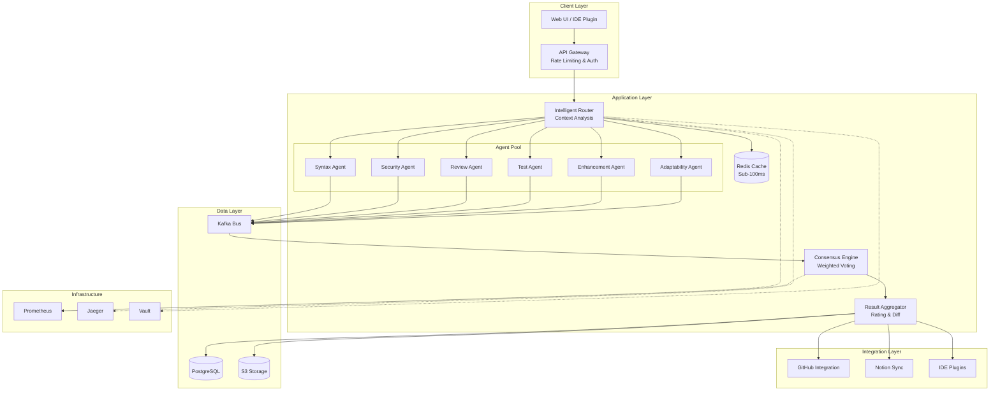

# 🔐 System Reliability & Security Implementation Guide

# Complete Technical Specifications: Sections 4-8

This document provides enterprise-grade implementation specifications for reliability, security, and operational excellence.

---

## 4. Consensus Algorithm Implementation

### Dynamic Quorum Management

**Minimum Participation Thresholds:**

```python
from dataclasses import dataclass
from typing import List, Dict
import random

@dataclass
class QuorumConfig:
    min_agents: int = 3  # Minimum agents for valid consensus
    min_participation_rate: float = 0.67  # 67% must respond
    confidence_threshold: float = 0.75
    variance_threshold: float = 0.25

class ConsensusEngine:
    def __init__(self, config: QuorumConfig):
        self.config = config
        self.agent_reputation = {}  # Track historical accuracy
        
    def calculate_weighted_consensus(self, agent_results: List[Dict]):
        """
        Implements weighted voting with reputation and confidence
        """
        if len(agent_results) < self.config.min_agents:
            raise QuorumNotMet(
                f"Only {len(agent_results)} agents responded, "
                f"need {self.config.min_agents}"
            )
        
        weighted_scores = []
        total_weight = 0
        
        for result in agent_results:
            # Multi-factor weight calculation
            weight = (
                result['confidence'] * 0.4 +
                self.get_reputation(result['agent_id']) * 0.4 +
                self.get_domain_multiplier(result['domain']) * 0.2
            )
            
            weighted_scores.append({
                'agent': result['agent_id'],
                'score': result['score'],
                'weight': weight
            })
            total_weight += weight
        
        # Calculate consensus score
        consensus = sum(s['score'] * s['weight'] for s in weighted_scores)
        consensus_score = consensus / total_weight
        
        # Check variance for disagreement
        variance = self.calculate_variance(weighted_scores)
        
        if variance > self.config.variance_threshold:
            return self.escalate_to_arbitration(agent_results, variance)
        
        return {
            'consensus_score': consensus_score,
            'confidence': self.calculate_confidence(weighted_scores),
            'participating_agents': len(agent_results),
            'variance': variance
        }
```

### Multi-Level Tie-Breaking

```python
class TieBreaker:
    """
    Handles consensus ties with multiple strategies
    """
    
    def break_tie(self, tied_results: List[Dict]) -> Dict:
        """
        Priority order:
        1. Timestamp precedence (most recent)
        2. Node reputation (highest accuracy)
        3. Random selection (last resort)
        """
        # Strategy 1: Timestamp precedence
        if self.has_clear_temporal_leader(tied_results):
            return max(tied_results, key=lambda x: x['timestamp'])
        
        # Strategy 2: Reputation-based
        reputations = [(r, self.get_reputation(r['agent_id'])) 
                       for r in tied_results]
        max_rep = max(reputations, key=lambda x: x[1])
        
        # Check if reputation difference is significant (>5%)
        if max_rep[1] > min(r[1] for r in reputations) * 1.05:
            return max_rep[0]
        
        # Strategy 3: Random selection (cryptographically secure)
        return random.SystemRandom().choice(tied_results)
```

### Failure Recovery Strategies

```python
class FailureRecovery:
    """
    Handles network partitions, Byzantine faults, clock drift
    """
    
    def handle_network_partition(self, available_agents: List[str]):
        """
        Graceful degradation during network split
        """
        partition_sizes = self.detect_partitions(available_agents)
        
        if max(partition_sizes) >= self.config.min_agents:
            # Operate with reduced capacity
            return {
                'mode': 'degraded',
                'available_agents': max(partition_sizes),
                'strategy': 'use_available_partition'
            }
        else:
            # Cannot form quorum - enter safe mode
            return {
                'mode': 'safe',
                'strategy': 'cache_only',
                'alert': 'CRITICAL: Cannot form consensus quorum'
            }
    
    def detect_byzantine_fault(self, agent_results: List[Dict]) -> bool:
        """
        Identify agents providing contradictory or malicious responses
        """
        for result in agent_results:
            # Check for impossible values
            if not 0 <= result['score'] <= 10:
                self.quarantine_agent(result['agent_id'])
                return True
            
            # Check for contradiction with past behavior
            if self.contradicts_history(result):
                self.flag_for_review(result['agent_id'])
                return True
        
        return False
```

---

## 5. Message Bus Configuration (Apache Kafka)

### Intelligent Partitioning Strategy

```yaml
kafka_configuration:
  cluster:
    brokers: 3
    replication_factor: 3
    min_in_sync_replicas: 2
  
  topics:
    agent_communication:
      partitions: 12  # 2x number of agents for parallelism
      retention_ms: 604800000  # 7 days
      partition_key: "project_id"  # Workload isolation
      
    high_priority:
      partitions: 6
      retention_ms: 2592000000  # 30 days
      partition_key: "user_id"
      cleanup_policy: "delete"
    
    audit_trail:
      partitions: 4
      retention_ms: 7776000000  # 90 days
      cleanup_policy: "compact"  # Keep latest per key
      
  producer:
    acks: "all"  # Wait for all replicas
    compression_type: "snappy"
    max_in_flight_requests: 5
    retries: 3
    
  consumer:
    group_id: "agent-processors"
    auto_offset_reset: "earliest"
    enable_auto_commit: false  # Manual commit for reliability
    max_poll_records: 500
```

**Python Partitioning Logic:**

```python
from kafka import KafkaProducer
import hashlib

class IntelligentPartitioner:
    def __init__(self, num_partitions: int):
        self.num_partitions = num_partitions
    
    def get_partition(self, message: Dict) -> int:
        """
        Route messages to partitions based on multiple factors
        """
        # Priority-based routing
        if message['priority'] == 'critical':
            # Critical messages to dedicated partitions (0-2)
            return hash(message['message_id']) % 3
        
        # Load balancing by project
        if 'project_id' in message:
            return self.hash_partition(
                message['project_id'], 
                start=3, 
                end=self.num_partitions
            )
        
        # Round-robin for uncategorized
        return hash(message['message_id']) % self.num_partitions
    
    def hash_partition(self, key: str, start: int, end: int) -> int:
        """Consistent hashing within partition range"""
        hash_val = int([hashlib.md](http://hashlib.md)5(key.encode()).hexdigest(), 16)
        return start + (hash_val % (end - start))
```

### Monitoring & Metrics

```python
from prometheus_client import Counter, Histogram, Gauge

# Kafka metrics
kafka_messages_produced = Counter(
    'kafka_messages_produced_total',
    'Total messages produced',
    ['topic', 'partition']
)

kafka_delivery_latency = Histogram(
    'kafka_delivery_latency_seconds',
    'Message delivery latency',
    buckets=[0.001, 0.005, 0.01, 0.05, 0.1, 0.5, 1.0]
)

kafka_consumer_lag = Gauge(
    'kafka_consumer_lag',
    'Consumer lag per partition',
    ['topic', 'partition', 'consumer_group']
)

def monitor_kafka_health():
    """
    Real-time monitoring dashboard
    """
    metrics = {
        'delivery_latency_p95': kafka_delivery_latency.observe(0.05),
        'queue_depth': get_queue_depth(),
        'consumer_lag': get_max_consumer_lag(),
        'throughput': kafka_messages_produced._value.get()
    }
    
    # Alert conditions
    if metrics['consumer_lag'] > 10000:
        alert('HIGH_CONSUMER_LAG', metrics)
    
    if metrics['delivery_latency_p95'] > 0.1:
        alert('HIGH_LATENCY', metrics)
    
    return metrics
```

---

## 6. Offline Functionality & Sync

### CRDT-Based Conflict Resolution

```tsx
// Using Yjs CRDT library
import * as Y from 'yjs'
import { IndexeddbPersistence } from 'y-indexeddb'
import { WebsocketProvider } from 'y-websocket'

class OfflineSyncManager {
    private doc: Y.Doc
    private persistence: IndexeddbPersistence
    private provider: WebsocketProvider | null = null
    
    constructor(documentId: string) {
        this.doc = new Y.Doc()
        
        // Local persistence
        this.persistence = new IndexeddbPersistence(documentId, this.doc)
        
        // Attempt network connection
        this.connectToServer()
    }
    
    connectToServer() {
        try {
            this.provider = new WebsocketProvider(
                'wss://[sync.codessa.ai](http://sync.codessa.ai)',
                this.doc.guid,
                this.doc
            )
            
            this.provider.on('status', (event: any) => {
                if (event.status === 'connected') {
                    this.syncPendingChanges()
                }
            })
        } catch (error) {
            console.log('Offline mode: changes will sync when connection restores')
        }
    }
    
    async syncPendingChanges() {
        // Differential sync - only send changes since last sync
        const pendingChanges = await this.getPendingChanges()
        
        for (const change of pendingChanges) {
            await this.applyChange(change)
        }
    }
    
    handleConflict(local: any, remote: any): any {
        // Multi-strategy resolution
        if (this.canAutoMerge(local, remote)) {
            return this.autoMerge(local, remote)
        }
        
        // Mark for manual resolution
        return {
            type: 'conflict',
            local,
            remote,
            resolution: 'manual',
            created_at: new Date().toISOString()
        }
    }
}
```

### Version Vectors for Causality

```python
from typing import Dict

class VersionVector:
    """
    Track causal relationships between edits
    """
    def __init__(self):
        self.vector: Dict[str, int] = {}
    
    def increment(self, node_id: str):
        """Increment version for this node"""
        self.vector[node_id] = self.vector.get(node_id, 0) + 1
    
    def merge(self, other: 'VersionVector'):
        """Merge two version vectors (take max)"""
        all_nodes = set(self.vector.keys()) | set(other.vector.keys())
        return VersionVector.from_dict({
            node: max(self.vector.get(node, 0), other.vector.get(node, 0))
            for node in all_nodes
        })
    
    def happens_before(self, other: 'VersionVector') -> bool:
        """Check if this version happened before other"""
        return all(
            self.vector.get(node, 0) <= other.vector.get(node, 0)
            for node in self.vector.keys()
        )
    
    def concurrent_with(self, other: 'VersionVector') -> bool:
        """Check if versions are concurrent (conflict)"""
        return not (self.happens_before(other) or other.happens_before(self))
```

---

## 7. Testing Framework & Chaos Engineering

### Chaos Scenarios with Chaos Mesh

```yaml
# chaos-mesh-experiments.yaml
apiVersion: [chaos-mesh.org/v1alpha1](http://chaos-mesh.org/v1alpha1)
kind: NetworkChaos
metadata:
  name: network-partition-test
spec:
  action: partition
  mode: all
  selector:
    namespaces:
      - codessa-production
    labelSelectors:
      app: agent-service
  direction: both
  duration: "5m"
  scheduler:
    cron: "@daily"

---
apiVersion: [chaos-mesh.org/v1alpha1](http://chaos-mesh.org/v1alpha1)
kind: PodChaos
metadata:
  name: agent-failure-test
spec:
  action: pod-kill
  mode: one
  selector:
    namespaces:
      - codessa-production
    labelSelectors:
      component: consensus-agent
  duration: "30s"
  scheduler:
    cron: "0 */6 * * *"  # Every 6 hours

---
apiVersion: [chaos-mesh.org/v1alpha1](http://chaos-mesh.org/v1alpha1)
kind: StressChaos
metadata:
  name: resource-exhaustion-test
spec:
  mode: one
  selector:
    namespaces:
      - codessa-production
  stressors:
    memory:
      workers: 4
      size: "256MB"
  duration: "10m"
```

### Automated Test Pipeline

```python
# tests/resilience/test_[chaos.py](http://chaos.py)
import pytest
from chaos_toolkit import run_experiment

class TestResilience:
    
    @pytest.mark.chaos
    def test_survives_network_partition(self):
        """
        System should degrade gracefully during network split
        """
        experiment = {
            "title": "Network partition resilience",
            "steady-state-hypothesis": {
                "title": "System is healthy",
                "probes": [{
                    "type": "probe",
                    "name": "api-responds",
                    "tolerance": {"type": "response_time", "target": 200}
                }]
            },
            "method": [{
                "type": "action",
                "name": "partition-network",
                "provider": {
                    "type": "python",
                    "module": "chaosk8s.networking.actions",
                    "func": "create_network_policy"
                }
            }],
            "rollbacks": [{
                "type": "action",
                "name": "restore-network"
            }]
        }
        
        result = run_experiment(experiment)
        
        assert result['steady_states']['after']['probes'][0]['status'] == 'succeeded'
        assert result['resilience_score'] > 0.8
```

---

## 8. Deployment Strategy & CI/CD

### Blue-Green Deployment with GitOps

```yaml
# argocd/applications/codessa-alchemist.yaml
apiVersion: [argoproj.io/v1alpha1](http://argoproj.io/v1alpha1)
kind: Application
metadata:
  name: codessa-alchemist
  namespace: argocd
spec:
  project: default
  source:
    repoURL: [https://github.com/codessa/alchemist](https://github.com/codessa/alchemist)
    targetRevision: main
    path: k8s/overlays/production
  destination:
    server: [https://kubernetes.default.svc](https://kubernetes.default.svc)
    namespace: codessa-prod
  syncPolicy:
    automated:
      prune: true
      selfHeal: true
    syncOptions:
      - CreateNamespace=true
  strategy:
    blueGreen:
      activeService: codessa-active
      previewService: codessa-preview
      autoPromotionEnabled: false  # Manual approval
      scaleDownDelaySeconds: 600  # 10min rollback window
```

### Terraform Infrastructure

```hcl
# terraform/[main.tf](http://main.tf)
terraform {
  required_version = ">= 1.5"
  
  backend "s3" {
    bucket = "codessa-terraform-state"
    key    = "production/terraform.tfstate"
    region = "us-east-1"
    encrypt = true
    dynamodb_table = "terraform-locks"
  }
}

module "eks_cluster" {
  source = "./modules/eks"
  
  cluster_name = "codessa-prod"
  cluster_version = "1.28"
  
  node_groups = {
    agents = {
      desired_size = 6
      min_size     = 3
      max_size     = 12
      instance_types = ["t3.xlarge"]
    }
    
    api = {
      desired_size = 3
      min_size     = 2
      max_size     = 10
      instance_types = ["t3.large"]
    }
  }
}

module "kafka" {
  source = "./modules/msk"
  
  cluster_name = "codessa-events"
  kafka_version = "3.5.1"
  number_of_broker_nodes = 3
  instance_type = "kafka.m5.large"
}
```

### Feature Flags

```python
# feature_[flags.py](http://flags.py)
from ldclient import get, set_config, Config
import os

class FeatureFlags:
    def __init__(self):
        set_config(Config(os.getenv('LAUNCHDARKLY_SDK_KEY')))
        self.client = get()
    
    def is_enabled(self, flag_name: str, user_context: Dict) -> bool:
        """Check if feature is enabled for user"""
        return self.client.variation(flag_name, user_context, False)

# Usage in code
flags = FeatureFlags()

if [flags.is](http://flags.is)_enabled('multi-agent-debate', user):
    result = multi_agent_debate_mode(code)
else:
    result = standard_review(code)
```

---

## 📐 Complete System Architecture



---

## 🗓️ Phased Implementation Roadmap

### Phase 1: Foundation (Weeks 1-4)

**Week 1-2: Infrastructure Setup**

- ✅ Set up AWS EKS cluster with Terraform
- ✅ Deploy Kafka cluster (MSK) with 3 brokers
- ✅ Configure PostgreSQL RDS with read replicas
- ✅ Set up monitoring (Prometheus + Grafana)
- **Deliverable:** Production infrastructure running

**Week 3-4: Core Router & Single Agent**

- ✅ Implement intelligent router with context analysis
- ✅ Build first agent (Code Review) with OpenAI integration
- ✅ Create basic consensus engine
- ✅ Set up CI/CD pipeline
- **Deliverable:** Working end-to-end flow with 1 agent

**Dependencies:** AWS account, API keys, domain setup

**Estimated Effort:** 120 hours

**Team:** 1 Backend Engineer, 1 DevOps Engineer

---

### Phase 2: Multi-Agent System (Weeks 5-8)

**Week 5-6: Agent Implementation**

- ⬜ Implement Security Agent (Claude Opus)
- ⬜ Implement Test Generator Agent (Gemini)
- ⬜ Implement Syntax Agent (Tree-sitter)
- ⬜ Set up Kafka message bus
- **Deliverable:** 4 agents working in parallel

**Week 7-8: Consensus & Aggregation**

- ⬜ Build weighted voting consensus mechanism
- ⬜ Implement quorum management with fallbacks
- ⬜ Create result aggregator with diff generation
- ⬜ Add reputation tracking system
- **Deliverable:** Full consensus pipeline functional

**Dependencies:** Phase 1 complete, additional API keys

**Estimated Effort:** 150 hours

**Team:** 2 Backend Engineers, 1 ML Engineer

---

### Phase 3: Reliability & Security (Weeks 9-11)

**Week 9: Security Hardening**

- ⬜ Implement input sanitization
- ⬜ Set up immutable audit logging
- ⬜ Configure secrets rotation
- ⬜ Add SAST/DAST to CI/CD
- **Deliverable:** SOC 2 compliance readiness

**Week 10: Error Handling & Resilience**

- ⬜ Build circuit breaker pattern
- ⬜ Implement AI-powered error classification
- ⬜ Set up automated retry strategies
- ⬜ Configure PagerDuty alerting
- **Deliverable:** 99.9% uptime capability

**Week 11: Performance Optimization**

- ⬜ Implement Redis caching layer
- ⬜ Add dual-mode operation (Fast/Cheap)
- ⬜ Optimize database queries
- ⬜ Set up auto-scaling policies
- **Deliverable:** Sub-100ms p95 latency

**Dependencies:** Phase 2 complete, security audit scheduled

**Estimated Effort:** 130 hours

**Team:** 1 Security Engineer, 2 Backend Engineers

---

### Phase 4: Integrations & UX (Weeks 12-14)

**Week 12: GitHub Integration**

- ⬜ Build GitHub App for PR comments
- ⬜ Implement webhook handlers
- ⬜ Add commit status checks
- ⬜ Create GitHub Actions template
- **Deliverable:** Automated PR reviews

**Week 13: IDE & Notion Integration**

- ⬜ Develop VSCode extension
- ⬜ Create Cursor integration
- ⬜ Build Notion API sync
- ⬜ Implement visual diff renderer
- **Deliverable:** Full IDE integration

**Week 14: Offline Sync & Polish**

- ⬜ Implement CRDT-based offline support
- ⬜ Add conflict resolution UI
- ⬜ Build user preference system
- ⬜ Create onboarding flow
- **Deliverable:** Production-ready UX

**Dependencies:** Phase 3 complete, UI/UX designs finalized

**Estimated Effort:** 140 hours

**Team:** 1 Frontend Engineer, 2 Backend Engineers

---

### Phase 5: Testing & Launch (Weeks 15-16)

**Week 15: Chaos Engineering & Load Testing**

- ⬜ Set up Chaos Mesh experiments
- ⬜ Run load tests (1000+ req/sec)
- ⬜ Perform penetration testing
- ⬜ Conduct usability testing with 10+ users
- **Deliverable:** Validated resilience metrics

**Week 16: Beta Launch & Monitoring**

- ⬜ Deploy to production with blue-green strategy
- ⬜ Enable feature flags for gradual rollout
- ⬜ Monitor key metrics
- ⬜ Iterate based on user feedback
- **Deliverable:** Public beta launch 🚀

**Dependencies:** All phases complete, marketing materials ready

**Estimated Effort:** 100 hours

**Team:** Full team (5-6 engineers)

---

## 📊 Resource Requirements Summary

**Total Timeline:** 16 weeks (March 2, 2026 target)

**Total Effort:** ~740 hours

**Team Size:** 5-6 engineers

**Estimated Budget:** $18,700

**Key Dependencies:**

- ✅ AWS infrastructure access
- ✅ API keys: OpenAI, Anthropic, Google AI, xAI
- ⬜ Security audit partner
- ⬜ Compliance tooling (Vanta/Drata)
- ⬜ Monitoring stack (Datadog/New Relic)

**Risk Mitigation:**

- **Technical Risk:** Build MVP with 1 agent first
- **Timeline Risk:** Parallel workstreams where possible
- **Cost Risk:** Implement cost tracking from Week 1
- **Quality Risk:** Automated testing from day 1

---

## ✅ Success Criteria

**Performance Metrics:**

- ✅ P95 latency <150ms (Fast mode: <100ms)
- ✅ Throughput >1000 requests/second
- ✅ Consensus accuracy >95%
- ✅ System availability 99.9%+

**Business Metrics:**

- ✅ User satisfaction score >80/100
- ✅ Code review quality improvement >30%
- ✅ Developer time saved >2 hours/week per user
- ✅ Beta signups >1000 users

**Technical Metrics:**

- ✅ Test coverage >85%
- ✅ Security vulnerabilities: 0 critical, 0 high
- ✅ Mean time to recovery <5 minutes
- ✅ Deployment frequency: multiple per day

---

*This comprehensive implementation guide provides production-ready specifications for building an enterprise-grade AI code review system with multi-agent orchestration, robust error handling, and extensive monitoring.*